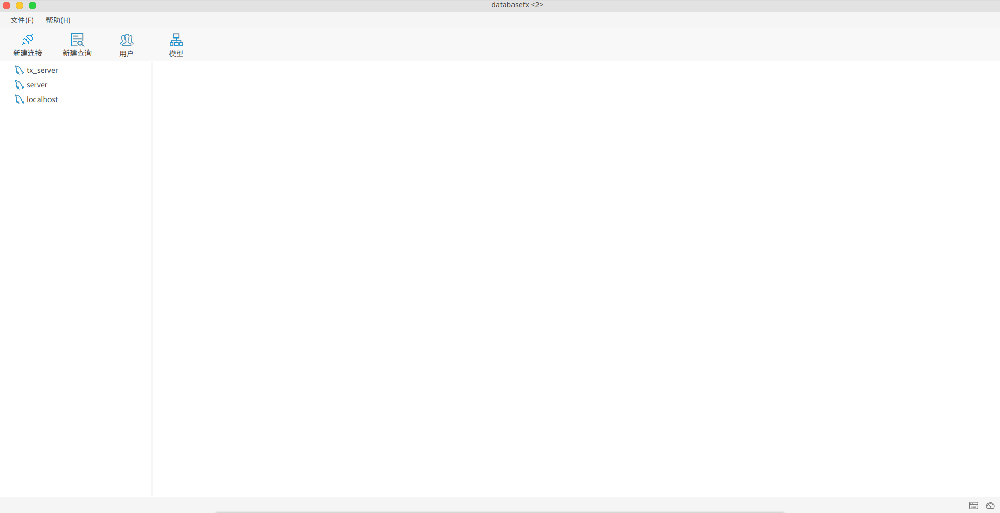

# DatabaseFX

This is a free, cross platform, open source database management tool based on JavaFX and vertx SQL client.


## Build
To build DatabaseFX, execute the following command:
```
gradlew build
```
To run the product, execute the following command:
```
gradlew run
```
NOTE : DatabaseFX requires Java 11 and above.

## Snapshots




