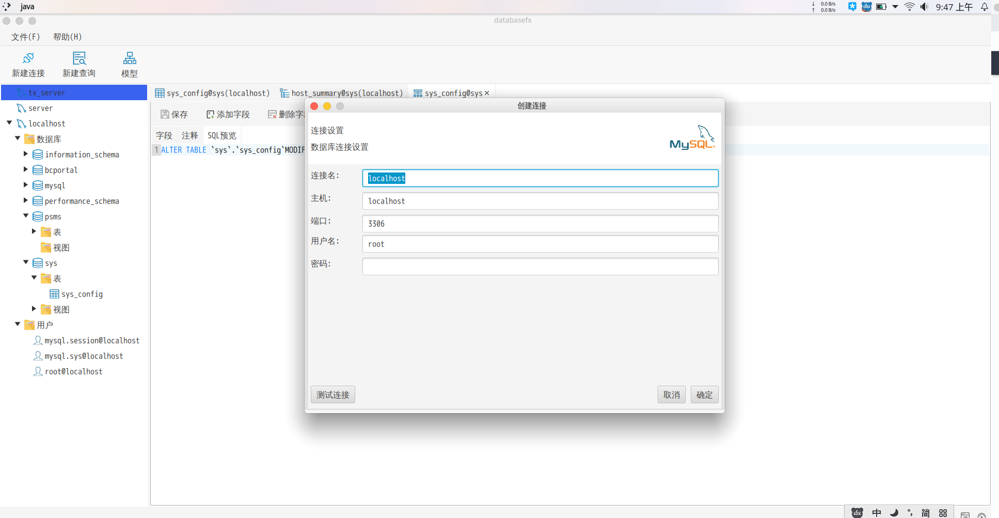
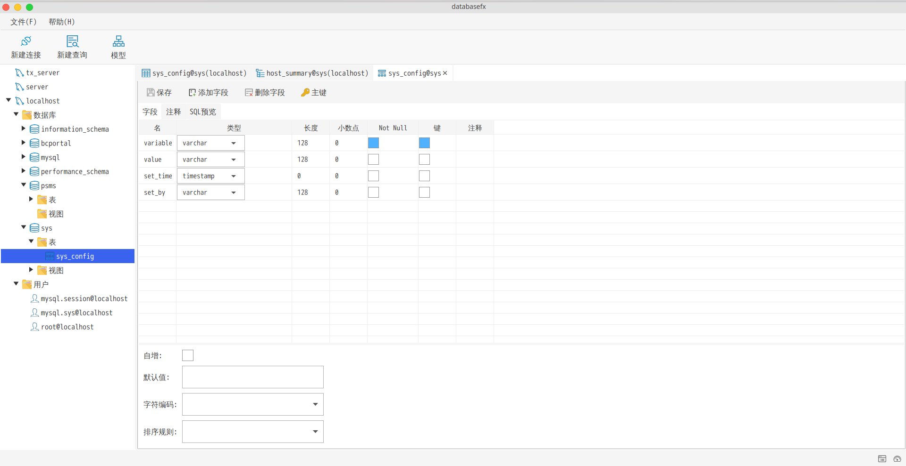
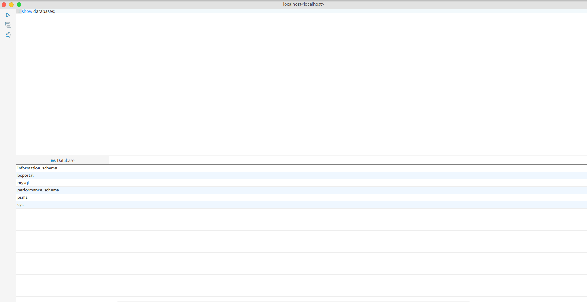
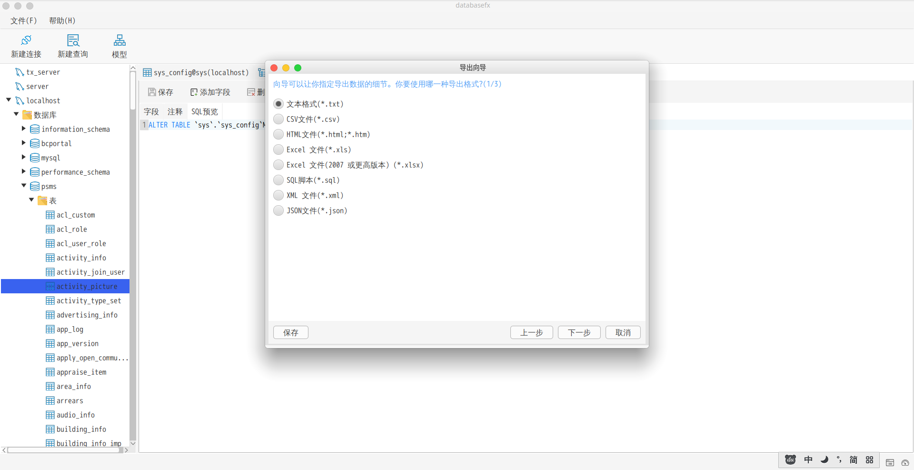
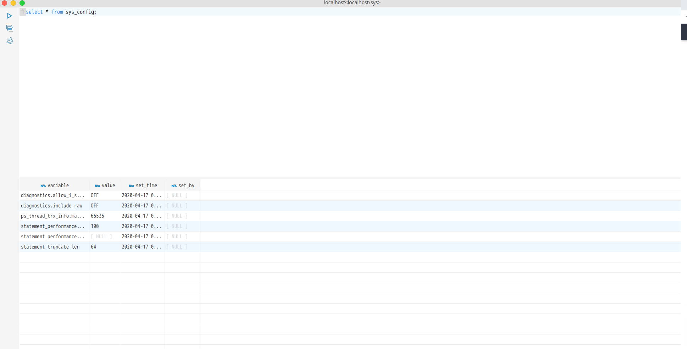

# databasefx

这是一个基于JavaFX和vertx SQL客户端的免费、跨平台、开源的数据库管理工具。


## Build
在运行databasefx前请先执行以下命令：
```
gradlew build
```
运行databasefx执行以下命令:
```
gradlew run
```
注意 : databasefx 要求java版本大于或者等于14,由于jdk下载比较慢，推荐大家到[injdk](https://injdk.cn/)下载

## 应用快照
### 应用主界面

### 创建你连接

### 数据库导航栏

### 设计表


### 导出数据

### SQL终端



